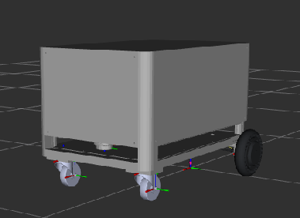

# Autonomous Following and Towing Robot

ROS 2 Humble 기반의 작업자 추종 및 견인 로봇 프로젝트입니다. 경로 기록·재생, Navigation, Fall Detection과 Safety Monitoring을 통합합니다.

<p align="center">
  
</p>

## Overview

작업자 추종부터 경로 기록, 정렬, 위치 추정, 자율 경로 재생까지 이어지는 작업 흐름을 제공합니다. Operator GUI에서 작업을 제어하고 낙상 감지나 detector 연결 상실 시 안전 정지 절차를 수행합니다.

## Project Information

| Item | Description |
| --- | --- |
| Project | Autonomous Following and Towing Robot |
| Program | 한이음 드림업 |
| Platform | ROS 2 Humble |
| Target Hardware | NVIDIA Jetson Orin Nano |
| Development | Linux amd64 Host + Docker |

## Team

| 이름 | 담당 분야 | 담당 영역 |
| --- | --- | --- |
| 박재범 | Path Planning 및 Autonomous Navigation Support | `aftr_status_led`, `aftr_path_manager` |
| 이인표 | Firmware 및 System Integration | `aftr_audio`, `aftr_bringup`, `aftr_description`, `aftr_gui`, `aftr_hardware`, `aftr_mode_manager`, `aftr_navigation`, `aftr_slam`, `aftr_teleop` |
| 이재빈 | Mechanical Design | 기구부 설계 및 CAD |
| 이하나 (팀장) | Leg Tracking 및 Fall Detection | `aftr_tracking`, `aftr_fall_detection` |

## Features

- Worker Following 및 Path Recording/Replay
- Nav2 Navigation과 SLAM
- Fall Detection 및 Safety Monitoring
- Operator GUI, audio 및 status LED
- ros2_control 기반 motor, LiDAR, RealSense 통합

## Quick Start

Host에서 Laptop Docker image를 빌드하고 Container shell을 엽니다.

```bash
cd ~/autonomous_following_towing_robot_ws/src/autonomous-following-towing-robot
./scripts/docker_build_laptop.sh
./scripts/docker_run_laptop.sh
```

Container의 `/workspace`에서 Workspace를 빌드합니다. 첫 빌드 직후 같은 shell에서 overlay를 source합니다.

```bash
./src/autonomous-following-towing-robot/scripts/build_ws.sh
source /workspace/install_laptop/setup.bash
```

상세 Build, Test 및 troubleshooting은 [Laptop Docker Development](docs/development/laptop-docker.md)를 참고하세요.

## Development Environment

### Laptop / Development PC

개발 환경은 Linux amd64 Host에서 Docker를 사용합니다. Container 내부는 Ubuntu 22.04 Jammy, ROS 2 Humble 및 CPU-only PyTorch로 구성됩니다. Host display가 있으면 GUI가 기본으로 연결되고, display가 없거나 `--headless` 옵션을 사용하면 headless로 실행됩니다. **Ubuntu 26 LTS amd64 Host에서** 전체 Workspace Build와 Test를 검증했습니다. 세부 결과는 [Testing](docs/testing.md)에 있습니다.

### Jetson Orin Nano

NVIDIA Jetson Orin Nano는 실제 Robot deployment 대상입니다. CUDA, RealSense, LiDAR, serial motor, GPIO와 GPU inference는 Jetson에서 검증합니다. Jetson Docker는 아직 구현되지 않았으며 JetPack/L4T 확인 후 별도 구성합니다.

## Packages

| Package | 역할 |
| --- | --- |
| `aftr_audio` | Operator audio feedback |
| `aftr_bringup` | Robot base, controller, LiDAR bringup |
| `aftr_description` | URDF 및 robot model |
| `aftr_fall_detection` | 낙상 관찰 및 heartbeat |
| `aftr_gui` | Operator GUI |
| `aftr_hardware` | ros2_control hardware interface |
| `aftr_mode_manager` | 작업 흐름 및 안전 상태 관리 |
| `aftr_navigation` | Nav2 및 localization 설정 |
| `aftr_path_manager` | 경로 기록·재생 및 pose 저장 |
| `aftr_slam` | SLAM Toolbox 설정 |
| `aftr_status_led` | Status LED feedback |
| `aftr_teleop` | 수동 `/cmd_vel` 입력 |
| `aftr_tracking` | 작업자 추종 |

## Workspace Layout

```text
~/autonomous_following_towing_robot_ws/
├── src/
│   ├── autonomous-following-towing-robot/
│   ├── laser_filters/
│   ├── serial-ros2/
│   └── sllidar_ros2/
├── build_laptop/
├── install_laptop/
└── log_laptop/
```

세 external sibling은 독립 Git repository입니다. `serial-ros2`의 ROS Package 이름은 `serial`이며, Laptop 산출물은 Jetson arm64 산출물과 공유하지 않습니다.

## Documentation

- [Laptop Docker Development](docs/development/laptop-docker.md)
- [Setup](docs/setup.md)
- [Architecture](docs/architecture.md)
- [Operation](docs/operation.md)
- [ROS Interfaces](docs/interfaces.md)
- [Safety](docs/safety.md)
- [Testing](docs/testing.md)
- [개발 규칙](AGENTS.md)
