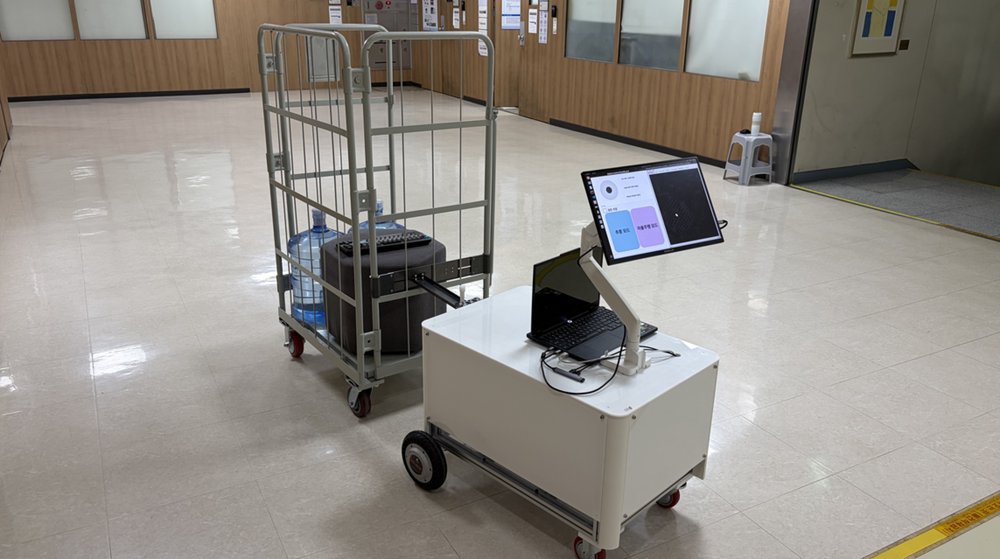
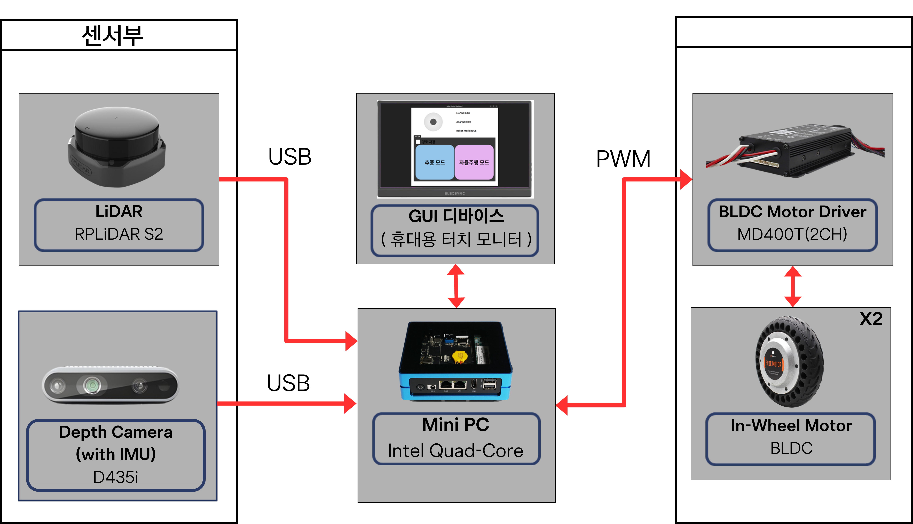
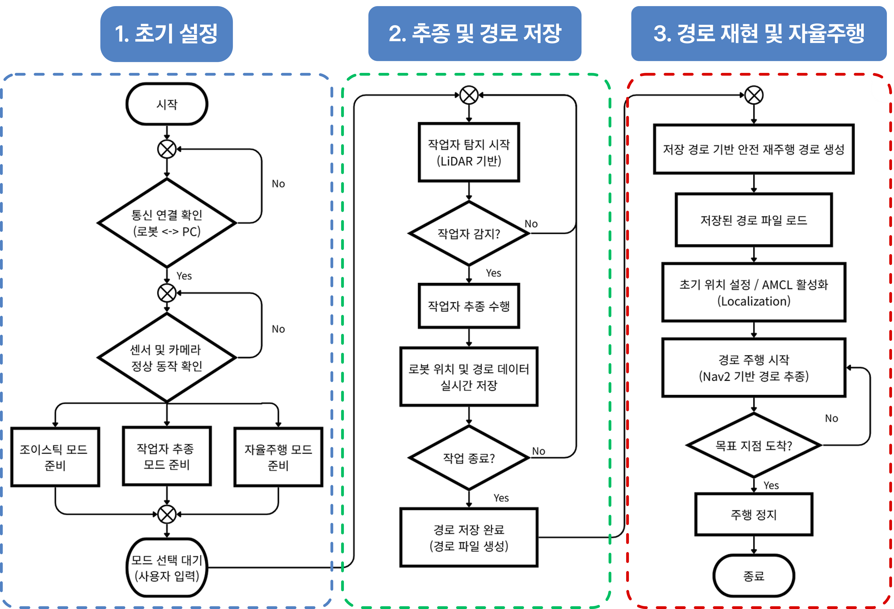
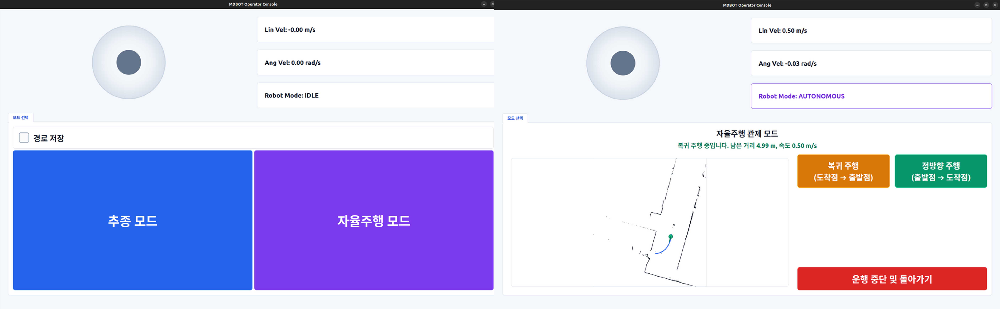
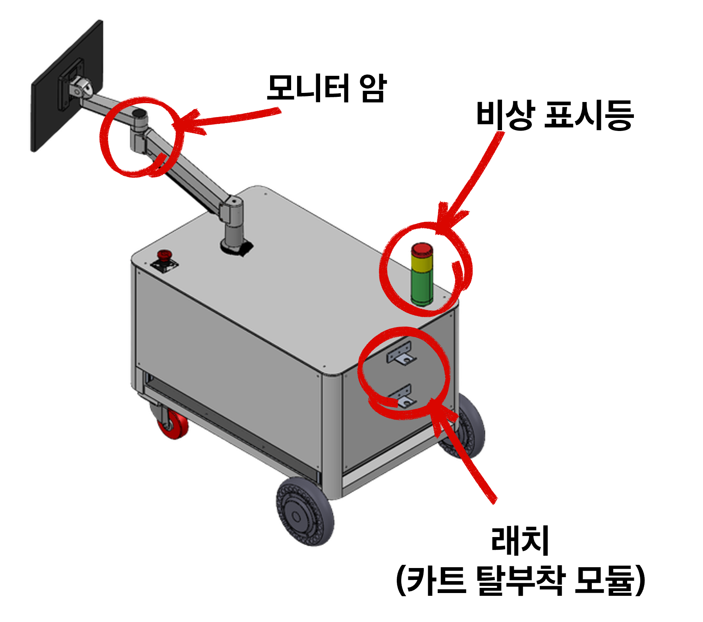
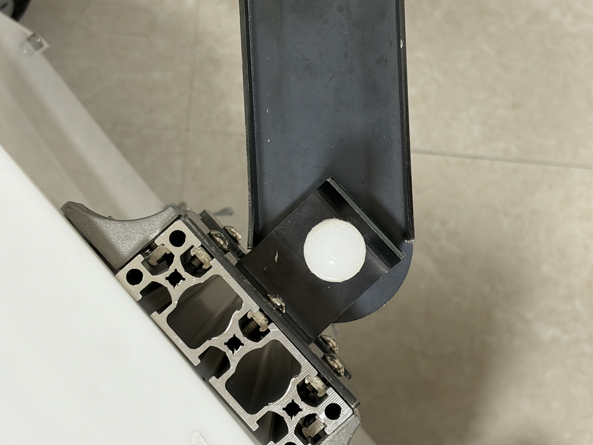

# Autonomous Following and Towing Robot

ROS 2 Humble 기반의 작업자 추종 및 견인 로봇입니다. 작업자 추종, 경로 기록·재생, SLAM, Nav2 자율주행, 낙상 감지와 안전 정지를 하나의 운용 흐름으로 통합합니다.

<p align="center">
  
</p>

## 프로젝트 개요

작업자를 추종하면서 이동 경로와 지도를 기록하고, 저장된 데이터를 기반으로 위치 추정 및 경로 재현을 수행합니다. Operator GUI를 통해 추종·경로 저장·자율주행을 제어하며 LiDAR, RealSense, BLDC 구동계와 안전 모니터링 기능을 함께 제공합니다.

## 프로젝트 정보

| 항목 | 내용 |
| --- | --- |
| 프로젝트 | Autonomous Following and Towing Robot |
| 프로그램 | 한이음 드림업 |
| 플랫폼 | ROS 2 Humble |
| 배포 대상 | NVIDIA Jetson Orin Nano |
| 개발 환경 | Linux amd64 Laptop / Jetson arm64 + Docker |

## 시스템 구성

<p align="center">
  
</p>

- **LiDAR**: RPLIDAR S2
- **Depth Camera**: Intel RealSense D435i
- **Motor Driver**: MD400T 2채널 BLDC Driver
- **Drive System**: BLDC In-Wheel Motor × 2
- **Software**: ROS 2 Humble, ros2_control, SLAM Toolbox, Nav2
- **Interface**: Operator GUI, Audio, Status LED

## 운용 흐름

<p align="center">
  
</p>

1. **초기 설정**: 통신, 센서, 카메라 상태 확인
2. **작업자 추종 및 경로 저장**: LiDAR 기반 추종과 경로·지도 기록
3. **경로 재현 및 자율주행**: 저장 데이터 기반 Localization 및 Nav2 경로 재생

자세한 운용 순서는 [운용 안내](docs/operation.md)를 참고하세요.

## Operator GUI

<p align="center">
  
</p>

- 추종 / 자율주행 모드 선택
- 경로 저장 설정
- 로봇 상태와 속도 표시
- 저장 경로 기반 정방향·복귀 주행
- 지도 및 현재 위치 모니터링
- 운행 중단 및 안전 복귀

## 기구 설계

<p align="center">
  
</p>

<p align="center">
  
</p>

## 주요 기능

- 작업자 추종 및 경로 기록
- 저장 경로 재생
- SLAM Toolbox 기반 Mapping
- Nav2 기반 Localization 및 Navigation
- 낙상 감지 및 Safety Stop
- Operator GUI / Audio / Status LED
- ros2_control 기반 BLDC Motor 제어
- Laptop / Jetson Docker 환경 분리

## 빠른 시작

### Laptop 개발 환경

```bash
cd ~/autonomous_following_towing_robot_ws/src/autonomous-following-towing-robot
./scripts/docker_build_laptop.sh
./scripts/docker_run_laptop.sh
```

Container 안에서:

```bash
./src/autonomous-following-towing-robot/scripts/build_ws.sh
source /workspace/install_laptop/setup.bash
```

### Jetson 배포 환경

```bash
cd ~/260929_ws/src/autonomous-following-towing-robot
./scripts/docker_build_jetson.sh
./scripts/docker_run_jetson.sh
```

Container 안에서:

```bash
./src/autonomous-following-towing-robot/scripts/build_ws.sh
source /workspace/install_jetson/setup.bash
```

전체 설치 조건, 모델·데이터 경로, 장치 연결 방법은 [설치 및 실행](docs/setup.md)을 참고하세요.

## ROS 패키지

| Package | 역할 |
| --- | --- |
| `aftr_audio` | 안내음 및 이벤트 음성 |
| `aftr_bringup` | Robot base, controller, LiDAR bringup |
| `aftr_description` | URDF / Xacro 및 robot model |
| `aftr_fall_detection` | 낙상 감지 및 heartbeat |
| `aftr_gui` | Operator GUI |
| `aftr_hardware` | ros2_control hardware interface |
| `aftr_mode_manager` | 작업 흐름 및 안전 상태 관리 |
| `aftr_navigation` | Nav2 / localization 설정 |
| `aftr_path_manager` | 경로 기록·재생 및 pose 저장 |
| `aftr_slam` | SLAM Toolbox 설정 |
| `aftr_status_led` | 상태 LED |
| `aftr_teleop` | 수동 `/cmd_vel` 입력 |
| `aftr_tracking` | 작업자 추종 |

## Team

| 이름 | 담당 분야 | 담당 영역 |
| --- | --- | --- |
| 박재범 | Path Planning 및 Autonomous Navigation Support | `aftr_status_led`, `aftr_path_manager` |
| 이인표 | Firmware 및 System Integration | `aftr_audio`, `aftr_bringup`, `aftr_description`, `aftr_gui`, `aftr_hardware`, `aftr_mode_manager`, `aftr_navigation`, `aftr_slam`, `aftr_teleop` |
| 이재빈 | Mechanical Design | 기구부 설계 및 CAD |
| 이하나 (팀장) | Leg Tracking 및 Fall Detection | `aftr_tracking`, `aftr_fall_detection` |

## 문서

- [설치 및 실행](docs/setup.md)
- [운용 안내](docs/operation.md)
- [시스템 구조](docs/architecture.md)
- [ROS 인터페이스](docs/interfaces.md)
- [안전 정책](docs/safety.md)
- [개발 및 유지보수](docs/maintenance.md)
- [하드웨어 및 발표 참고 자료](docs/references/README.md)
